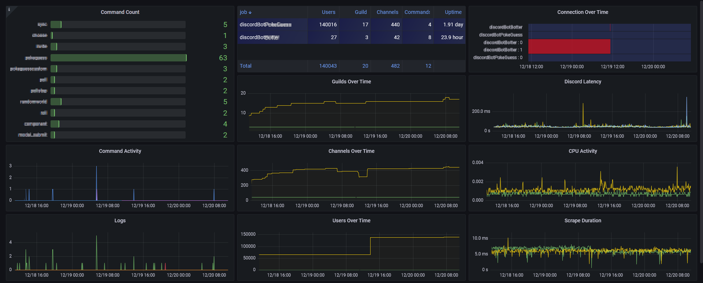

`discord-ext-prometheus` is an extension library I made to make it easy to add Prometheus metrics to your Discord bots. It also supports sharding for larger bots.

Prometheus is a popular open-source monitoring and alerting system. It allows users to collect and store metrics from their applications and infrastructure, and then visualize and analyse those metrics using tools like Grafana.

Here are the exposed metrics:

| Name                           | Documentation                                 | Labels                            |
|--------------------------------|-----------------------------------------------|-----------------------------------|
| `discord_connected`            | Determines if the bot is connected to Discord | `shard`                           |
| `discord_latency`              | Latency to Discord                            | `shard`                           |
| `discord_event_on_interaction` | Amount of interactions                        | `shard`, `interaction`, `command` |
| `discord_event_on_command`     | Amount of commands                            | `shard`, `command`                |
| `discord_stat_total_guilds`    | Amount of guild this bot is a member of       | None                              |
| `discord_stat_total_channels`  | Amount of channels this bot is has access to  | None                              |
| `discord_stat_total_users`     | Amount of users this bot can see              | None                              |
| `discord_stat_total_commands`  | Amount of commands                            | None                              |
| `logging`                      | Log entries                                   | `logger`, `level`                 |

# Installation

To use this extension, simply install it via pip:

```bash
python -m pip install discord-ext-prometheus
```

Then, in your bot's code, you can import and add the `discord.ext.prometheus` Cog to the bot using `bot.add_cog()`. Here is an example:

```python
import asyncio
from discord.ext import commands
from discord.ext.prometheus import PrometheusCog

async def main():
	bot = commands.Bot(
		command_prefix='!',
		intents=Intents.all(),
	)

	await bot.add_cog(PrometheusCog(bot))

	await bot.start('YOUR TOKEN')

asyncio.run(main())
```

Once the cog is added, the metrics will be exposed at `localhost:8000/metrics`.

It's also possible to add logging metrics if you need to visualize warnings and errors. To do so, import the `LoggingHandler` and add it to your logger handlers. Here is an example with a simple bot:

```python
import asyncio
import logging
from discord.ext import commands
from discord.ext.prometheus import PrometheusCog, PrometheusLoggingHandler

logging.basicConfig(level=logging.INFO)
logging.getLogger().addHandler(PrometheusLoggingHandler())

async def main():
	bot = commands.Bot(
		command_prefix='!',
		intents=Intents.all(),
	)

	await bot.add_cog(PrometheusCog(bot))

	@bot.listen()
	async def on_ready():
		logging.info(f'Logged in as {bot.user.name}#{bot.user.discriminator}')

	logging.info('Starting the bot')
	await bot.start('YOUR TOKEN')

asyncio.run(main())
```

# Grafana

I also made a Grafana dashboard that uses those metrics. It's available for free on [Grafana Dashboards](https://grafana.com/grafana/dashboards/17670-discord-bot/).


