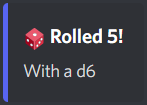

This tutorial focuses on the MVC pattern and how you can apply it to your own bot. I'll be presenting it with a simple dice roll command.

I am assuming that you already got your token. If not, get it on the [Discord Developer Portal](https://discord.com/developers/applications).


# What is MVC

MVC is a design pattern commonly used for developing user interfaces. It's a great way to properly organize your code.

- The **Model** is the component that defines, hold and manages data.
- A **View** takes data to create a visual representation of it. 
- The **Controller** manages user input to build and return the request


# Setting the Directory Structure

Here is the basic directory structure we will be following.

```txt
.env
requirements.txt
src/
├─ controllers/
├─ models/
├─ views/
╰─ main.py
```

This is the content of `.env`, you'll have to place your token in this file:

```env
DISCORD_BOT_TOKEN={TokenHere}
```

The content of `requirements.txt`:

```requirements.txt
python-dotenv
discord.py
```

Install the dependencies with `python -m pip install -r ./requirements.txt`.


# Creating a Model

Create a new file under `src/models/` named `DiceRoll.py`.

The model will be a very simple class, its only purpose is to define and represent information.

```python
from dataclasses import dataclass

@dataclass
class DiceRoll:
	result: int
	maximum: int
```

Notice the `@dataclass` decorator, it's a built in utility that generates common methods such as `__repr__()` and `__init__()`. More on the [dataclasses documentation](https://docs.python.org/3/library/dataclasses.html).


# Creating a View

Create a new file under `src/views/` named `DiceRollView.py`.

Now it's time to think about how we want to display this information! A discord bot mostly reply in plain text, but we can use the fancier embed messages that allow you to add a little bit more personality to your messages.

```python
from discord import Embed, Color
from models.DiceRoll import DiceRoll

class DiceRollEmbed(Embed):
	def __init__(self, diceRoll: DiceRoll):
		super().__init__()

		self.color = Color.from_str('#5865f2')
		self.title = f"🎲 Rolled {diceRoll.result}!"
		self.description = f"With a d{diceRoll.dice}"
```

Here is what this should look like:



Embeds messages have a lot of options like descriptions, fields, author and timestamps. Check out all the features on the [Embed class documentation](https://discordpy.readthedocs.io/en/stable/api.html?highlight=embed#embed).


# Creating the Controller

Create a new file under `src/controllers/` named `DiceRollController.py`.

The controller will be in charge of handling a roll request. Or in other words, what happens when the user types `!roll`? This is where we build the model and the view before returning the result to the user.

```python
from discord.ext import commands
import random
from models.DiceRoll import DiceRoll

class DiceRollController(commands.Cog):

	def __init__(self, bot):
		self.bot = bot

	@commands.command(
		name="roll",
		description="Roll a dice!",
	)
	def rollCommand(self, ctx, dice: int = 6):
		diceRoll = DiceRoll(
			result=random.randint(1, dice),
			dice=dice,
		)

		embed = DiceRollView.DiceRollEmbed(diceRoll)

		await ctx.send(embed=embed)
```

`command.Cog` is the parent class used to declare a group of commands. Find more on the [Cogs documentation](https://discordpy.readthedocs.io/en/stable/ext/commands/cogs.html#ext-commands-cogs).

We now have the full MVC pattern in place!


# Main.py

The only part missing is the main file where we configure and run the bot.

```python
import asyncio
import os
from dotenv import load_dotenv
from discord import Intents
from discord.ext import commands
from controllers.DiceRollController import DiceRollController

async def main():
	load_dotenv()

	bot = commands.Bot(
		command_prefix='!',
		intents=Intents.all(),
	)

	await bot.add_cog(DiceRollController(bot))

	bot.run(os.environ['DISCORD_BOT_TOKEN'])

if(__name__ == '__main__'):
	asyncio.run(main())
```

Note that we need to add our controller to the bot using the `add_cog()` method.


# Trying it Out

Run the bot by executing the main file.

```bash
python ./src/main.py
```

In Discord, write `!roll`. You should see your view with all the information from the `DiceRoll` model! You can also change the dice by using a different number `!roll 20`.


# Template Code

MVC is used in my personal discord bot template. It's totally free to use and available on my [GitHub](https://github.com/Apollo-Roboto/Template-Python-DiscordBot). That template will differ and be more advanced than what is presented here, but could be very helpful.