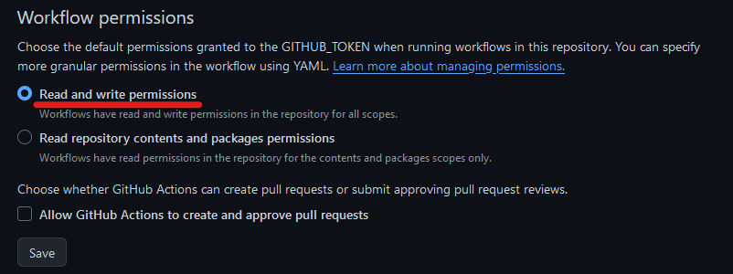
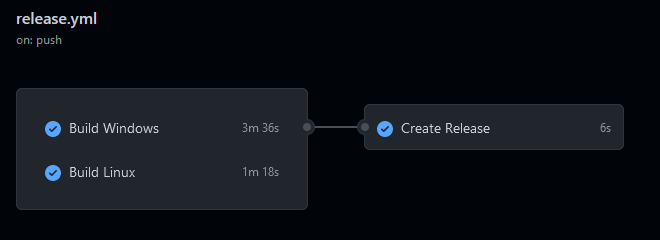
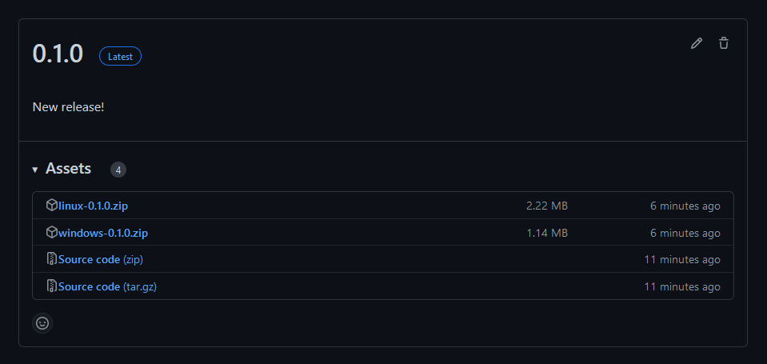

In this post, I'll be releasing Rust binaries for both Windows and Linux. Most of the example here could be applied to other languages too.

# Triggering the Workflow

Create a workflow file at `.github/workflows/release.yml`.

Since each releases on GitHub must be associated with a Git tag. We'll use them as our trigger for the workflow.

```yaml
name: Release

on:
  push:
    tags:
      - "*.*.*"

# enables colors in the log output during builds
env:
  CARGO_TERM_COLOR: always
```

# Building the Executables Jobs

Let's create jobs to build on each platform. We will also upload the created binaries to make them accessible later on.

```yaml
jobs:
  build_windows:
    name: Build Windows
    runs-on: windows-latest

    steps:
      - uses: actions/checkout@v2

      - name: Build
        run: cargo build --release

      - name: Upload Window Executable
        uses: actions/upload-artifact@v4
        with:
          name: 'windows-${{ github.ref_name }}'
          path: '${{ github.workspace }}/target/release/amazing-software.exe'
          if-no-files-found: error
          retention-days: 1

  build_linux:
    name: Build Linux
    runs-on: ubuntu-latest

    steps:
      - uses: actions/checkout@v2

      - name: Build
        run: cargo build --release

      - name: Upload Linux Executable
        uses: actions/upload-artifact@v4
        with:
          name: 'linux-${{ github.ref_name }}'
          path: '${{ github.workspace }}/target/release/amazing-software'
          if-no-files-found: error
          retention-days: 1
```

The Cargo flag `--release` is to optimize the compilation for release. This usually results in smaller and faster software.

The artifacts should be named after their platform and the current tag name. `windows-${{ github.ref_name }}` will become `windows-1.1.0`.

> ⚠ Notice how the Linux executable doesn't have an extension like Windows's `.exe`. Make sure to build locally and validate the name and location of your executables.

The retention days of the artifact is lowered to 1 because we'll only use them during this workflow.

# The Release Job

This job will download all artifacts we've published to add them on the release page for anyone to download.

Before we start writing this job, we need the workflow to have permissions to create new releases.

- From the repository on GitHub.
- Go to "Settings" > "Actions" > "General" > "Workflow permissions".
- Select "Read and write permissions" and click "Save".



There are three steps to this release: download the previously built executables, zip them in a user friendly way and release them on GitHub.

We'll use a third party action called `softprops/action-gh-release` to create the release. [Feel free to checkout their repository](https://github.com/softprops/action-gh-release).

```yaml
  release:
    name: Create Release
    runs-on: ubuntu-latest
    needs:
      - build_windows
      - build_linux

    steps:
      - name: Download Executables
        uses: actions/download-artifact@v4
        with:
          path: '${{ github.workspace }}/artifacts'

      - name: Zip Executables
        run: |
          pushd "${{ github.workspace }}/artifacts"
          for dir in ./*/; do
            dir_name=$(basename "$dir");
            zip_file="./$dir_name.zip";
            zip -r "$zip_file" "$dir_name";
          done
          popd

      - name: Release
        uses: softprops/action-gh-release@v1
        with:
          body: New release!
          files: ${{ github.workspace }}/artifacts/*.zip
```

With the `needs` property, this job won't start until the two builds are completed.

If you'd like to include a file for the text of the release page (like a changelog). You can add a checkout step and use the `body_path` parameter from `softprops/action-gh-release`.

# Making a Release

Now that we have our workflow file. Let's ship a release! All you need to do is push a new Git tag.

```bash
git tag "0.1.0"
git push --tag
```

The workflow will start right away.



Here is what the release looks like when completed. All binaries are easily accessible and properly named.



---

That's it! In case you need the full workflow file for reference.
```yaml
name: Release

on:
  push:
    tags:
      - "*.*.*"

env:
  CARGO_TERM_COLOR: always

jobs:
  build_windows:
    name: Build Windows
    runs-on: windows-latest

    steps:
      - uses: actions/checkout@v4

      - name: Build
        run: cargo build --release

      - name: Upload Window Executable
        uses: actions/upload-artifact@v4
        with:
          name: 'windows-${{ github.ref_name }}'
          path: '${{ github.workspace }}/target/release/amazing-software.exe'
          if-no-files-found: error
          retention-days: 1

  build_linux:
    name: Build Linux
    runs-on: ubuntu-latest

    steps:
      - uses: actions/checkout@v4

      - name: Build
        run: cargo build --release

      - name: Upload Linux Executable
        uses: actions/upload-artifact@v4
        with:
          name: 'linux-${{ github.ref_name }}'
          path: '${{ github.workspace }}/target/release/amazing-software'
          if-no-files-found: error
          retention-days: 1

  release:
    name: Create Release
    runs-on: ubuntu-latest
    needs:
      - build_windows
      - build_linux

    steps:
      - name: Download Executables
        uses: actions/download-artifact@v4
        with:
          path: '${{ github.workspace }}/artifacts'

      - name: Zip Executables
        run: |
          pushd "${{ github.workspace }}/artifacts"
          for dir in ./*/; do
            dir_name=$(basename "$dir");
            zip_file="./$dir_name.zip";
            zip -r "$zip_file" "$dir_name";
          done
          popd

      - name: Release
        uses: softprops/action-gh-release@v1
        with:
          body: New release!
          files: ${{ github.workspace }}/artifacts/*.zip
```
